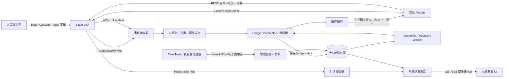
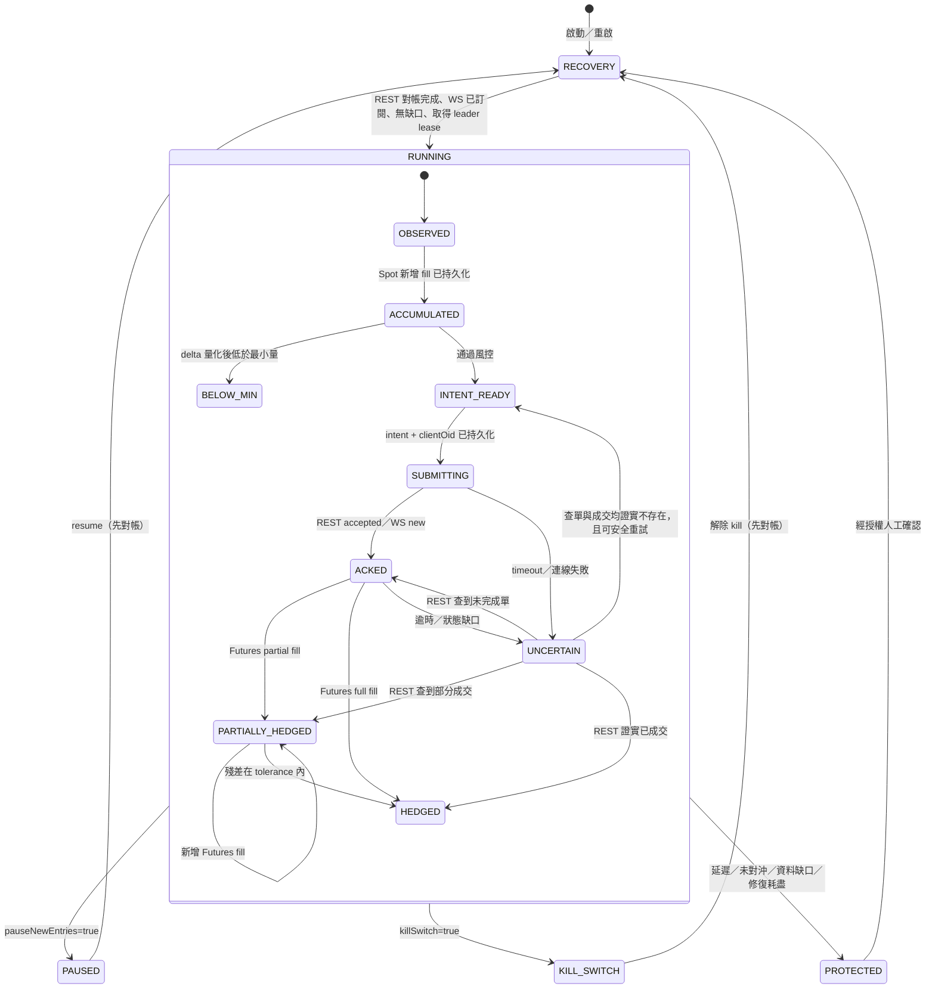

# Bitget STRC／rSTRC 半手動事件對沖系統：MVP 架構規劃

> 文件狀態：規劃草案（不含交易程式、部署或真實下單）<br>
> 基準日期：2026-09-10<br>
> 適用商品：`RSTRCUSDT`（Reality Spot）／`STRCUSDT`（USDT-FUTURES perpetual）

## 0. 結論與證據等級

### 可行性結論

**有條件可行，建議進入「唯讀接線與沙盒／極小額演練」階段，但目前不可直接進入實盤。** 核心設計是將人工現貨訂單的「新增成交量」轉成一筆可重放、可稽核且冪等的合約對沖意圖；訂單 ACK 只更新送單狀態，永遠不增加已對沖量。

本文件使用以下標籤，避免把設計假設誤當成交易所保證：

- **最新官方確認**：應由實作者在開工日以 Bitget 官方文件及公開 API 再驗證；本次環境於 2026-09-10 對 `bitget.com` 與 `api.bitget.com` 的連線均被出口代理回覆 HTTP 403，因此本文件不宣稱已完成當日線上複核。
- **設計建議**：系統自身應採取的可靠性、安全性與資料模型決策，不代表 Bitget API 契約。
- **仍待確認**：若未確認就可能造成拒單、數量錯誤或錯誤持倉，屬實盤前阻擋項目。

### 官方文件可支持、但開工時仍須逐欄複核的能力

依題目提供的 Bitget UTA 官方文件範圍，UTA 提供行情、訂單、成交、資產及持倉能力，並有公開 ticker 與私有 order WebSocket 頻道。**最新官方確認（待開工日複核）**的業務語意為：下單回應僅表示請求已受理，實際成交應依私有成交／訂單更新及 REST 查詢判定；商品規格必須由 instrument API 動態取得，不得硬編碼。

### 實盤前阻擋項目

1. **商品存在及帳戶資格**：確認同一 UTA 帳戶確實可交易 `RSTRCUSDT` Reality Spot 與 `STRCUSDT` USDT perpetual，且地區、KYC、帳戶模式均符合資格。
2. **正確 API 契約**：逐項確認 REST base URL、WS URL、`category`／`instType`、頻道名、登入簽章、訂閱參數、事件欄位及枚舉值；不得只依本文件中的功能名稱寫死端點。
3. **數量語意**：以官方商品資料及最小測試單確認 Spot market buy 的 `qty` 是 quote USDT 金額，而 Spot sell 與 Futures `qty` 是 base token 數量；同時確認手續費若以 base asset 扣除時，私有回報中可用哪個欄位取得淨到帳量。
4. **對沖商品經濟關係**：確認 rSTRC 與 STRC 的可對沖比例、換算／贖回機制、合約乘數、結算資產與基差風險；名稱相近不代表必然 1:1。
5. **Reality 交易時段**：確認休市、假日、盤前／盤後、熔斷或只減倉等狀態，及其在 instrument／calendar／ticker 中的判斷欄位。
6. **持倉模式**：帳戶須設定並驗證為 one-way；確認 futures `side`、`reduceOnly` 和 position mode 的實際契約。
7. **WS 完整性**：確認事件是否提供唯一 `tradeId`、遞增序號、累計成交量、成交明細、重連補數窗口及資料保留期。若無可靠序號，不可聲稱能以「事件序號」去重，必須改用成交 ID 與累計量。

## 1. MVP 邊界與不可變條件

### 納入

- 公開行情僅供 UI 顯示。
- 私有 WS 接收人工 Spot 訂單的成交更新。
- 以 Spot **實際新增成交量**建立反向 Futures 對沖意圖。
- 私有 WS 配合 REST 查單／成交／持倉完成確認與修復。
- 公開 UI 只有讀取能力；管理操作有獨立、受保護且可稽核的通道。

### 不納入

- 價差觸發 Spot 下單、雙邊並行開倉、自動平倉、多商品／多策略框架。
- UI 或公開 HTTP API 直接觸發任何訂單。
- 把 REST ACK、WS accepted／new 狀態、或「已送出」視為成交。

### 六項不可變條件（invariants）

1. `ACK != FILL`：只有確認的 Futures fill 才增加 `futuresHedgedQty`。
2. 人工 Spot **buy** 的對沖方向是 Futures **sell**；人工 Spot **sell** 是 Futures **buy**。
3. 同一份 Spot 成交增量最多納入一次；同一個 hedge intent 最多建立一次，重試沿用既有 `clientOid` 或先查後決定。
4. `killSwitch=true` 時所有新增／補送 Futures 訂單一律拒絕；查詢、對帳、告警繼續。
5. 啟動、失聯或資料有缺口時先對帳，未證明狀態一致前不得進入 `RUNNING`。
6. 公開路由不存在寫入交易狀態或呼叫交易 adapter 的程式路徑。

## 2. 單一 Web Service 架構



### 服務內邏輯隔離

建議目錄邊界為 `public-ui`、`read-model`、`domain`、`exchange-adapter`、`workers`、`admin`。公開 controller 只能依賴 `read-model`，不得 import `exchange-adapter`；以架構測試在 CI 強制依賴方向。交易 adapter 僅接受 coordinator 建立且已持久化的 `hedgeIntentId`，不接受任意 symbol／side／qty 的 HTTP 輸入。

### Koyeb 與持久性

- **設計建議**：去重、對沖進度與恢復游標不得使用容器記憶體或本機暫存檔作為唯一來源，應透過抽象的持久狀態介面保留。具體資料庫產品、schema、索引與 migration 均不納入本次規劃。
- **設計建議**：MVP 固定一個 active trader。若 Web Service 被擴成多 replica，仍須以互斥租約確保只有一個 worker 可以送單；租約的技術實作方式留待實作階段決定。非 leader 只服務唯讀 UI，租約失效時先進入 `RECOVERY`，不可直接接手下單。
- **設計建議**：HTTP health 分成 liveness 與 readiness。公開 UI 可健康但 trader 未 ready；狀態頁需清楚顯示 `RECOVERY`／`PROTECTED`，不能以 HTTP 200 掩蓋交易模組失效。

## 3. 資料流與數量定義

### 正負號與單位

所有核心數量以 **base token** 表示，運算使用 decimal library，禁止 JavaScript `number`。

- `spotFilledSignedQty`：Spot buy 為正、sell 為負；採交易所可證實的**成交毛量（gross base fill）**。
- `spotFilledNetQty`：已去重後，納入策略範圍的 `spotFilledSignedQty` 加總。
- `hedgeTargetSignedQty = -spotFilledNetQty * hedgeRatio`：Futures 目標；負值代表 sell、正值代表 buy。
- `futuresHedgedSignedQty`：只由已確認 Futures fills 加總，不由 ACK 加總。
- `hedgeDeltaSignedQty = hedgeTargetSignedQty - futuresHedgedSignedQty`。
- `deltaQty = abs(hedgeDeltaSignedQty)`；顯示與閾值比較前，以保守價格換算未對沖名目。

此定義修正了直接用無符號 `spotFilledNetQty - futuresHedgedQty` 在 Spot sell 場景可能方向模糊的問題。

### 每筆事件的處理交易

1. 驗證 schema、symbol、product type 與 order ownership；資料不全則隔離並觸發對帳。
2. 判別人工 Spot 訂單。MVP 採「專用 subaccount」策略：只監聽指定子帳戶中的人工 Spot 訂單，再搭配 symbol 檢核。Futures order event 永不當成 Spot 觸發源。
3. 以 `tradeId` 去重；若只有累計成交量，則針對同一 order 串行處理並計算 `max(exchangeCumFilled - processedCumFilled, 0)`。累計量倒退或同版本內容衝突時轉 `RECOVERY`。
4. 先以原子化保存 raw event、正規化 fill、累計量與 hedge intent；確認只有在保存成功後才允許 worker 送單。具體儲存模型不在本次範圍。
5. coordinator 串行化同一策略的意圖，先扣除「已成交」與「仍在工作中的未成交 hedge qty」，避免上一張尚未 fill 時又送同一 delta。
6. 量化後若小於最小下單量，保留 residual，不湊整向上；達到可下單量後才送出。

### 可選 token 顆數估算（僅 UI 計算器，不下單）

```text
spotNotionalUsdtRaw = targetSpotQtyToken * spotBestAsk
spotOrderNotionalUsdt = ceil_to_quote_precision(
  spotNotionalUsdtRaw * (1 + spotNotionalBufferPct / 100)
)
futuresTargetQty = floor_to_qty_step(targetSpotQtyToken * hedgeRatio)
```

估算器必須顯示行情時間戳與「非保證成交量」。Reality Spot market buy 最終 base fill 可能因滑價、部分成交及費用而不同，實際對沖仍只使用 fill。

## 4. 事件狀態機



### pause 與 kill 的精確語意

- `pauseNewEntries=true`：不納入**新的人工 Spot order** 作為正常入口，但仍須記錄所有 fill、完成既有 hedge、對帳及告警。若人工在 paused 時仍成交，MVP 規則為「記錄並告警，但恢復後預設忽略，不自動補 hedge」。
- `killSwitch=true`：禁止所有新 Futures place／replace；既有訂單是否自動 cancel 屬另一項風控決策，MVP 預設不自動 cancel，只告警並由人工處理。事件照常持久化，曝險照常計算。
- 狀態優先序：`KILL_SWITCH > PROTECTED/RECOVERY > PAUSED > RUNNING`。

## 5. 參數與限制規則

| 參數 | 初始值 | 驗證／語意 | 變更方式 |
|---|---:|---|---|
| `spotSymbol` | `RSTRCUSDT` | 啟動時向官方 instrument 資料驗證 Reality Spot、可交易 | restart-only |
| `futuresSymbol` | `STRCUSDT` | 驗證 USDT perpetual、合約乘數、可交易、one-way 相容 | restart-only |
| `hedgeClientOidPrefix` | `HEDGE_` | 加上環境、策略、intent ID；符合官方長度／字元限制 | restart-only |
| `hedgeRatio` | `1.0` | `>0`；經濟關係未證實前不得實盤 | 受保護、版本化 |
| `hedgeFillBasis` | `gross_base_fill` | 以 Spot 成交毛量作為對沖計算基準；費用改走獨立 PnL 欄位 | 固定（MVP） |
| `futuresOrderFallbackMode` | `market_only` | Futures 對沖只用市價；若市價不可用則告警並人工處理，不自動改 IOC | 固定（MVP） |
| `maxHedgeDelayMs` | `3000` | 起點採 Spot fill 的交易所時間與本地接收時間中較保守者；終點為 Futures **fill**，不是 ACK | 受保護 |
| `hedgeToleranceQty` | **待校準** | 不得小於 Futures qty step；需同時受名目上限約束 | 實盤阻擋 |
| `maxUnhedgedNotionalUsdt` | **待校準** | 用保守可執行價：需買用 ask、需賣用 bid，並加壓力 buffer | 實盤阻擋 |
| `unhedgedNotionalBufferPct` | `0.5` | 未對沖名目換算壓力 buffer（%） | 受保護 |
| `maxRecoveryAttempts` | `3` | 每個 recovery episode；查詢不明不可盲目重送 | 受保護 |
| `recoveryTimeoutMs` | `10000` | 超時進 `PROTECTED`，不自動假設訂單失敗 | 受保護 |
| `pauseNewEntries` | `false` | 語意見上節；所有變更寫 audit log | 私有管理通道 |
| `killSwitch` | `false` | fail-closed；設定讀取失敗視為 true | 私有管理通道 |
| `spotNotionalBufferPct` | **待校準** | 只用於人工下單估算器，不影響 fill-based hedge | 受保護 |

### 每次下單前動態限制

以 instrument response 為準取得 price tick、quantity step、quote precision、最小／最大 qty、最小／最大 notional、交易狀態。不得把 decimal places 當 step size；量化使用整數格數或 Decimal：

- Futures hedge qty 一律朝零 `floor_to_step`，不得為達 minimum 而向上製造反向曝險。
- 剩餘 dust 留在 residual；若其保守名目超過上限，轉 `PROTECTED`，不可用不合規數量硬送。
- 檢查餘額、Futures 可用保證金、持倉／風險限額、當前交易時段及 API rate limit。
- Futures 市價不可用或被交易所拒絕時，MVP 不自動改為 IOC/限價，直接告警並轉人工處理。
- 商品 metadata 設 TTL 並定期刷新；發現規格變更時暫停送單、重新量化並告警。

## 6. REST／WebSocket 功能對照（MVP 最小集合）

> 下表列「官方文件功能名稱」而非保證不變的 path。**仍待確認**欄位必須在開工時由官方頁面鎖定為一份 versioned API contract fixture。

| 通道／功能 | 用途 | 重要輸入／輸出 | 使用時機 | 證據狀態 |
|---|---|---|---|---|
| Public WS — Tickers Channel | Spot/Futures bid、ask、時間戳 | product type、symbol、bid/ask | 常駐；UI，不觸發開倉 | 官方文件功能；URL／欄位待複核 |
| Private WS — Order Channel | Spot 與 Futures 訂單狀態、累計／單次成交 | orderId、clientOid、side、status、fill qty/price、tradeId/sequence、timestamp | 常駐；主要低延遲訊號 | 官方文件功能；FILL 枚舉與欄位待複核 |
| Market — Get Instruments | 規格、精度、最小量、狀態 | category、symbol；qty step、min qty/notional、status | 啟動、TTL 更新、下單前 | 官方文件功能；Reality category 待複核 |
| Market — Get Tickers／order book | REST 行情快照、WS 恢復 | symbol；bid/ask/time | 啟動／WS gap | 官方文件功能；實際端點待複核 |
| Trading — Place Order | 僅送 Futures 反向對沖 | Futures symbol、side、orderType、qty、clientOid、one-way 參數 | intent 已落庫且過閘門後 | 官方文件功能；market order qty 語意待複核 |
| Trading — Get Order | 解決 ACK timeout／未知結果 | orderId 或 clientOid；status、cumFill | submit 不明、恢復 | 官方文件功能；clientOid 查詢能力待複核 |
| Trading — Get Fills | 補 WS 缺口、以 tradeId 重建 | symbol/orderId、時間範圍、cursor | 重連、重啟、對帳 | 官方文件功能；保留期與分頁待複核 |
| Trading — Open Orders | 找出既有 hedge 工作單 | product、symbol、clientOid | 啟動／週期對帳 | 官方文件功能；命名待複核 |
| Position — Current Positions | 驗證實際 Futures exposure | symbol、side/net qty | 啟動／週期／故障 | 官方文件功能；one-way 欄位待複核 |
| Account — Assets/Balance | 可用 USDT／資產與保證金檢查 | coin、available、equity | 啟動／送單前／故障 | 官方文件功能；UTA account 欄位待複核 |
| Reality — Market data/calendar | 可交易時段與市場狀態 | symbol/session/calendar/status | 啟動及週期刷新 | 官方文件功能；時區與假日語意待複核 |

### 官方參考連結

- [UTA 概述](https://www.bitget.com/docs/uta/uta-intro)
- [Reality 指南](https://www.bitget.com/docs/uta/reality-trading-guide)
- [下單／查單／成交](https://www.bitget.com/docs/catalog/trading/order-management)
- [商品規格與行情](https://www.bitget.com/docs/catalog/market/market-data)
- [Reality 行情／時段／日曆](https://www.bitget.com/docs/catalog/reality/market-data)
- [公開 Ticker WS](https://www.bitget.com/docs/uta/websocket/public/Tickers-Channel)
- [私有訂單 WS](https://www.bitget.com/docs/uta/websocket/private/Order-Channel)
- [資產與費率](https://www.bitget.com/docs/catalog/account/assets-balance)
- [持倉管理](https://www.bitget.com/docs/catalog/trading/position-management)

## 7. 冪等與恢復需求（不含資料庫設計）

本次只定義行為需求，不規劃資料庫產品、schema、資料表、索引、ORM、migration 或備份拓撲。後續實作選擇的持久狀態機制，必須能支援事件去重、原子化狀態更新、重啟恢復、操作稽核及唯一 active trader；本文件不限定其資料模型。

- Spot fill 優先以交易所 `tradeId` 識別；沒有可靠 trade ID 時，以 order 的累計成交 high-water mark 計算尚未處理的增量。
- Hedge intent ID 必須由穩定輸入決定，讓相同事件重播時產生相同結果。
- `clientOid` 建議由 `{prefix}{env}_{intentId}_{attempt}` 產生，並符合官方字元與長度限制。
- 網路 timeout 後先以相同 `clientOid` 查 order、open orders 與 fills；只有交易所明確證實不存在，才依官方冪等契約決定沿用原 ID 或增加 attempt。
- 任何「查不到但查詢本身不完整」都是 `UNCERTAIN`，不是可重送證據。

## 8. 異常、告警與重啟恢復

### 異常決策表

| 異常 | 自動處理 | 保護／人工條件 |
|---|---|---|
| Spot partial fills | 每個新增 fill 更新目標；考慮工作中 hedge qty，達 step/min 才分批補 | 殘差名目或延遲超限 |
| 重複／亂序 | tradeId 去重 + cumulative high-water mark | 累計倒退、版本衝突或無法補 gap |
| WS 中斷 | 立刻標記資料 stale；停止新 intent submit；重連後 REST 補單、成交與持倉 | 補數窗口不足或資料不一致 |
| place order timeout | 狀態 `UNCERTAIN`；依 clientOid 查詢，禁止立即重送 | recovery timeout／次數耗盡 |
| HTTP 429 | 尊重官方 retry header；full-jitter exponential backoff、全域限速、查詢優先級 | 延遲／曝險超限，不因 429 放寬風控 |
| Futures rejected | 記錄 code/message，刷新 metadata/balance；僅可判定為可修復者重試 | qty、margin、market closed 等持續失敗 |
| 持久狀態不可用／失去 leader | fail closed，停止送單；以 fencing token 阻止舊 leader 繼續工作 | 一律進 recovery |
| 時鐘漂移 | NTP 監控、簽章時間錯誤時停止私有操作 | 漂移超限 |
| kill switch | 下單 adapter 最內層再次檢查，拒絕 place/replace | 單人模式下維持至本人明確解除；如日後多人協作再啟用雙人覆核 |

### 啟動／重啟 runbook

1. 啟動為 `RECOVERY`，讀取 secrets 與已簽署／版本化設定；未取得持久狀態與唯一 leader lease 時 fail closed。
2. 同步時間；載入 instruments、Reality session/calendar、資產、持倉。
3. 連線並驗證 private WS 登入及訂閱；保存 subscription ACK，但不把它當 order ACK/fill。
4. REST 分頁查詢策略 symbols 的 open orders、近期 orders 與 fills；窗口須覆蓋「最後成功 cursor／時間」至現在並留 overlap。
5. 對每個自有 `clientOid` 重建 requested、working、filled；對 Spot tradeId 重建人工 fills，重播時仍須通過同一套去重規則。
6. 比對本地推導的 Futures fills、REST orders/fills 與實際 one-way position。差異不能合理解釋時進 `PROTECTED`，不得自動以新單抹平。
7. 對帳一致、WS 已追上、行情未 stale、風控均通過後才原子更新為 `RUNNING`；其後仍週期對帳。

### 主要告警

- `hedge_fill_latency_ms > maxHedgeDelayMs`（從 Spot fill 到 Futures fill）。
- `unhedged_notional_usdt > maxUnhedgedNotionalUsdt`。
- WS stale／sequence gap、REST 429、order uncertain、position mismatch、leader churn、持久狀態失效、instrument/session 變更。
- 告警內容只含 order/client reference、數量與錯誤碼；API secret、passphrase、簽章、完整 header 絕不寫入。

### 通知通道（Telegram / TG）

- MVP 通知通道使用 Telegram（TG）Bot。
- 至少推送以下事件：對沖逾時、未對沖名目超限、私有 WS 斷線/重連失敗、`killSwitch` 啟用、`PROTECTED` 狀態進入。
- TG 訊息最小欄位：`time`、`symbol`、`eventType`、`impactNotionalUsdt`、`deltaQty`、`suggestedAction`。
- 通知失敗不得中斷交易狀態機，但需在本地記錄為可追蹤錯誤並重試。

## 9. 公開 UI 與管理面安全

### 公開唯讀面

- `GET /api/public/market`：Spot/Futures bid、ask、spread、exchange/local timestamp、stale flag。
- `GET /api/public/status`：`running/paused/kill-switch/recovery/protected`、是否可交易、最後對帳時間、保護原因、是否開盤中（`isMarketOpenNow`）。
- `GET /api/public/session`：當前交易階段（`pre_market` / `regular` / `after_hours` / `overnight`）、交易所時區、台北時間對照、資料時間戳。
- `GET /api/public/events`：經過遮罩及限量的成交／對沖結果、`deltaQty`、未對沖名目；不得暴露 account ID、完整 order/clientOid 或原始 payload。
- UI 明示資料延遲與「唯讀，不提供下單」。所有 public endpoints rate limit、CSP、安全 header 與 cache policy 明確化。

### 管理面

管理面決策如下：若 Koyeb 無法保證私有 ingress，MVP **不提供遠端管理寫入 route**，只保留公開唯讀 UI；`pause/kill/config` 由受控維運流程在內部執行。僅「URL 難猜」或共用 bearer token 不合格。

目前為單人使用，MVP 先不做 RBAC 與雙人覆核；若未來開啟遠端管理 route，至少要有短時管理 token、IP/Zero Trust allowlist、CSRF 與 replay 防護、每次操作 reason + append-only audit。管理 route 只寫 command/config，不直接呼叫 place order。

Secrets 只由 Koyeb Secret 注入 server runtime；禁止使用 `PUBLIC_` 類前端 build-time 變數。CI 不持有交易 secret，瀏覽器 bundle、source map、錯誤追蹤及 log formatter 都必須有 secret scanning／redaction 測試。

## 10. 測試矩陣

| 類別 | 情境 | 預期結果 |
|---|---|---|
| 單元 | Spot ACK/new，cumFill=0 | 不建立 hedge intent、不呼叫 adapter |
| 單元 | buy fill | 建立等比例 Futures sell target |
| 單元 | sell fill | 建立等比例 Futures buy target |
| 單元 | 3 次 partial fill | 僅新增量被累計；量化後分批，總量不超過目標 |
| 單元 | 同 tradeId 重播 | 去重規則命中，目標與送單次數不變 |
| 單元 | 累計事件亂序 | high-water mark 不倒退；無 tradeId 的衝突進 recovery |
| 單元 | 自有前綴／Futures event | 不成為 Spot trigger，防事件回圈 |
| 單元 | qty step/min notional 邊界 | 朝零量化，dust 保留，不向上過度對沖 |
| 單元 | kill 在 intent 與 submit 間切換 | adapter 內層拒絕，零 place-order call |
| 整合 | place ACK 後永不 fill | hedged qty 不變；逾時告警並進 protected/recovery |
| 整合 | place response timeout，但交易所已收單 | 以 clientOid 找回；不產生第二張單 |
| 整合 | HTTP 429 序列 | full-jitter/backoff，最多修復次數，超限人工介入 |
| 整合 | WS 斷線期間 Spot fill | REST backfill 後恰納入一次，再安全恢復 |
| 整合 | 程序在保存 intent／HTTP 前後逐點崩潰 | 恢復後每個 intent 不遺失且不重複曝險 |
| 整合 | 兩 replica 同時成 leader | fencing 後只有一個可送單 |
| 對帳 | 本地推導 fill 與實際 position 不符 | 禁止 running，不自動猜測補單，告警人工判讀 |
| 安全 | public route fuzz／method swap | 無任何交易或 config mutation 路徑 |
| 介面 | market session 切換（pre/regular/after/overnight） | UI 在可接受延遲內正確顯示 `isMarketOpenNow` 與當前交易階段 |
| 安全 | bundle/log/CI artifact secret scan | 不含 key、secret、passphrase、簽章 |
| 驗收 | Spot partial fill 到 Futures fill | 在設定延遲內，殘差及名目均在閾值內 |

測試 adapter 應支援可程式化 fault injection：duplicate、reorder、drop、delay、429、timeout-after-accept、partial fill、reject 與 reconnect gap。先以固定 fixtures 做 deterministic tests，再接 Bitget 測試環境；若 Reality 無測試商品，須以 mock contract test 加上受控極小額演練，且需人工批准。

## 11. 分階段交付與 Go／No-Go

### Phase 0：官方契約與風控定案

- 逐頁保存開工日、文件版本／頁面 hash、REST/WS request-response fixture。
- 以公開 API 驗證兩商品規格、狀態、精度、最小量及行情；由人工帳戶驗證交易資格與 one-way mode。
- 校準 `hedgeToleranceQty`、`maxUnhedgedNotionalUsdt`，並驗證 1:1 經濟假設（費用處理已定案為 gross fill 對沖、費用獨立入帳）。
- **Gate**：第 0 節七項阻擋問題任一未解即 No-Go。

### Phase 1：唯讀垂直接線

- 單一 Web Service、持久狀態介面、公開 ticker、私有 WS、事件稽核軌跡、唯讀 UI；不在此階段設計資料庫。
- 完成 schema validation、去重、行情 stale、重連及 REST backfill；交易 adapter 強制 dry-run。
- **Gate**：連續觀察一個完整 Reality 交易週期，人工成交與 REST 對帳一致，公開面無寫入能力。

### Phase 2：模擬狀態機與故障演練

- 導入 deterministic intent、signed quantity、risk gate、leader fencing、recovery 與所有 fault injection 測試。
- shadow 模式只產生「本來會送出的單」，與人工計算逐筆比對。
- **Gate**：測試矩陣全通過；重播同一事件集合產生完全相同的最終狀態與 intent IDs。

### Phase 3：受控半手動小額試行

- 人工逐次批准測試窗口；使用最低可行額度、單 replica、現場監控與預先演練 kill runbook。
- 每次只允許一筆人工 Spot order，完成 Futures fill 與對帳後才准下一筆。
- **Gate**：連續成功樣本、零重複 hedge、所有 latency/residual 符合已批准門檻後，才評估提高限額；不因此擴大 MVP 功能。

### Phase 4：CI/CD 生產化

- PR 必須通過 lint、typecheck、unit/integration、architecture boundary、dependency/secret/container scan。
- protected main 需 review 才可合併；Koyeb 自 main 建置 immutable image，部署後先 recovery/read-only health，再由明確 promotion gate 啟用 trader。
- 部署失敗或新版本無法對帳時回滾程式，但**不可回滾資料／交易事實**；回滾版本也必須先 recovery。

## 12. 開工前決策結果（已定案）

1. **對沖數量口徑**：採 `gross base fill`（Spot 成交毛量）計算 hedge；手續費走獨立 PnL 欄位。
2. **Futures 對沖下單語意**：採 `market_only`；若市價不可用，直接告警並人工處理，不自動改 IOC/限價。
3. **人工 Spot 單辨識**：採「專用 subaccount」監聽策略，只處理該帳戶下指定 symbol 的 Spot fill。
4. **paused 期間成交處理**：記錄並告警，但恢復後預設忽略，不自動補 hedge。
5. **kill 期間既有未成交對沖單**：保留並告警，由人工決策是否撤單。
6. **未對沖名目估值**：採保守可執行價（買看 ask、賣看 bid）並加 `0.5%` 壓力 buffer。
7. **管理面部署策略**：若 Koyeb 無法保證私有 ingress，MVP 不提供遠端管理寫入 route，只保留公開唯讀 UI。

仍需在開工時校準：`hedgeToleranceQty`、`maxUnhedgedNotionalUsdt`、`spotNotionalBufferPct`。完成校準前，系統最多運行於 dry-run／唯讀模式。
